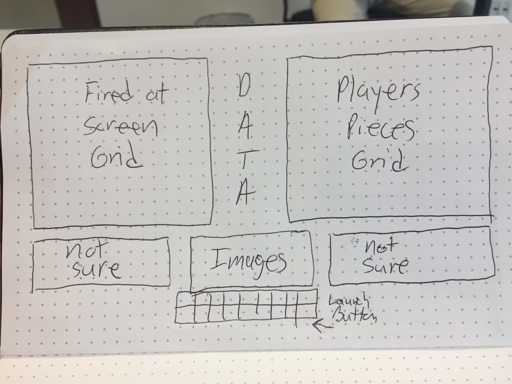

# battleship

User stories-
I haven't decided yet if this will be a one or 2 player game, but the premise will be for player to arrange ships on the gameboard
and fire shots at the other players hidden ships by picking a square on a shots-fired grid.  If the shots fired grid corresponds
to a grid square on which one of the other players ships is located, that square is scored as a hit. Game ends when one side loses 
all ships.
Basically, the normal battelship game
-----------------Minimum Viable Product-------------------------------
Still thinking about what else I can add to the game
  

